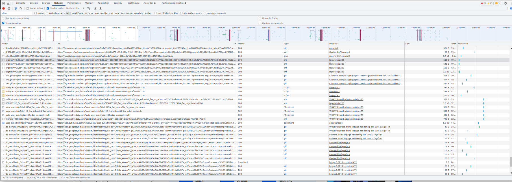
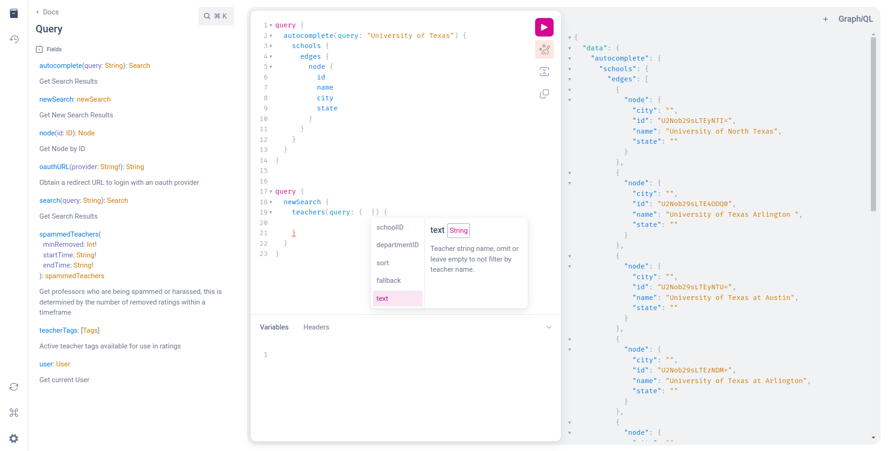

# RateMyProf-GraphiQL

surprisingly ratemyprof has a pretty great graphql api, 
**not that you'd be able to tell given this manmade horror beyond human comprehension:**


*(their standard network traffic)*

---

the endpoint: `https://www.ratemyprofessors.com/graphql` <br>
use `Authorization: `Basic dGVzdDp0ZXN0` <br>

### the api key is just some random guy's key i found lmao


<br>
<br>

## but you cant GraphiQL  :(((

context: normally you could go to the path `ratemyprofessors.com/graphiql` in chrome (for ex. at `utexas.instructure.com/graphiql`)
and you get this epic graphical API playground but it no work here =(



> so thats why this exists

## this repo just proxys the GraphQL endpoint and serves the GraphiQL API explorer 

**basically**
- it hosts the standard static template for the GraphiQL page
    - uses localhost:8080/graphql as endpoint in template
- proxys everything from ^ to the real endpoint to get around CORS


### Setup

```bash
git clone https://github.com/An-GG/RateMyProf-GraphiQL.git
cd RateMyProf-GarphiQL
npm install
```

### Run
```bash
node ./proxy-server.js
```

then go to [http://localhost:8080](http://localhost:8080)

try messing around with this demo query:


```graphql
query {
  
  newSearch {
    teachers(query: {schoolID:"U2Nob29sLTEyNTU="}, first: 100) {
      edges {
        node {
          firstName
          lastName
        }
      }
    }
  }
  
  autocomplete(query: "University of Texas") {
    schools {
      edges {
        node {
          id
          name
          city
          state
        }
      }
    }
  }
  
}

```